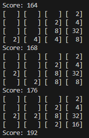

# 2048 using C++



## Description

This is a console version of the popular game '2048' implemented using C++. It has some nifty features like dynamically resizing the board in console depending on the largest number in play.

### Installing

Windows users can download the the ZIP and run the .exe.
Alternatively, Linux users can run the game by downloading the .cpp file and using the following commands:

```bash
cd /path/to/2048.cpp
g++ 2048.cpp -o 2048
./2048
```


